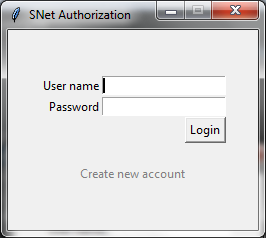
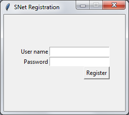
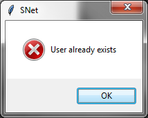
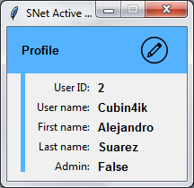

# SNet Chat
A server-based group chat for communicating with a number of people (conference like).

Features:
* Group messaging

*A simple chat app with unlimited number of simultaneous speakers.
Users are notified when anyone enters or leaves a chat room.
You can see your current user name (nickname) and profile picture (avatar) in the top bar.
You can also change it if you want by clicking on it.*

* Authentication system

*Any time a user attempts to log in he sends a pair of «user-password» data to server database.
After the server makes sure the user exists and the password is correct it then generates a **session key** and shares it back with the user.
Thus, users may stay logged in after relaunching the app.
They can log out by hitting «Exit» button any time.*

* Registration system

*When creating a new account the server will check if the user already exists.
You will not be able to send an empty field request.*

* List of online users

* Profile editing

*Users are assigned with unique ID-numbers which they cannot change.
But they can edit their first name, last name and profile picture.
A limit of 4 MB is set within a client app, but it can be easily adjusted in [GUI](http://github.com/client_v10/gui.py) file (line 403).*

This application is built using Python (3.8) on a lowest possible level.
No third-party libraries where used. Only built-in modules such as:
* socket
* threading
* os
* tkinter
* time
* random
* PIL

«With Statement Context Managers» are used to operate and process sockets, text or binary files.
Own protocol upon TCP/IP is used to build communication between server and clients.
This protocol is based on simple headers to handle client requests.
A server can be launched using a single line of code:

`my_server = Connection("server")`

Classes used:
* Connection

*A framework with threading features that handles socket connections including serving clients and sending requests*

* Application(Frame)

*GUI application that inherits Frame class of tkinter module*

* User

*Main class that creates, stores and operates all user profile data and credentials*

* Admin(User)

*Inherits User class. Not available in version 1.0*

* DataHandling

*Operates all data transfer including saving, creating and passing*

* Session

*Creates, terminates and controls sessions and keys*

* Chat

*Creates a thread of permanent connection with server and handles all messages*

* Wallet

*Not available in version 1.0*

* ImageProcessor

*Class to process images like user avatars (round shaped) with transparent corners* 
